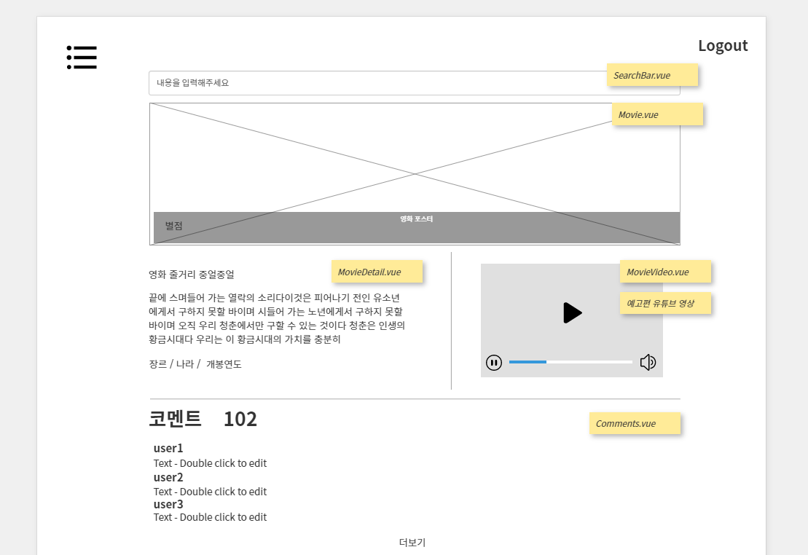

# 🎇FINAL PROJECT - 🎇

### 00. 프로젝트 개요

> 한 학기 동안 배운 모든 내용을 종합한 영화 커뮤니티 사이트 개발

- #### 목표

  - 영화 정보 기반 추천 서비스 
  - 커뮤니티 서비스

  

- #### 팀원 정보 & 역할

| 이름   | 직위 | 역할     |
| ------ | ---- | -------- |
| 임지성 | 팀장 | Backend  |
| 이승아 | 팀원 | Frontend |

- #### 개발 환경

  - 언어
    - Python 3.7.7
    - Django 
    - Node 14.15.0
    - Vue.js 2.6+
  - 도구
    - vsCode
    - Chrome Browser
  - 아키텍처
    - Django REST API 서버 & Vue.js

---

### 01. UI 설계

> 카카오 Oven을 이용하여 웹페이지 레이아웃을 설계했다. 
>
> 목업을 팀원과 공유하여, 백엔드 담당 팀원 입장에서 보다 수월하게 데이터 구성을 할 수 있도록했다. 

---

### 02. 컴포넌트 구조 설계

> 웹페이지 레이아웃에 따라 기능별 컴포넌트를 구분하고, 각 기능마다 컴포넌트의 구조를 설계했다.

- auto indent (진짜..최고의 기능)

`Shift` + `Alt` + `F`

