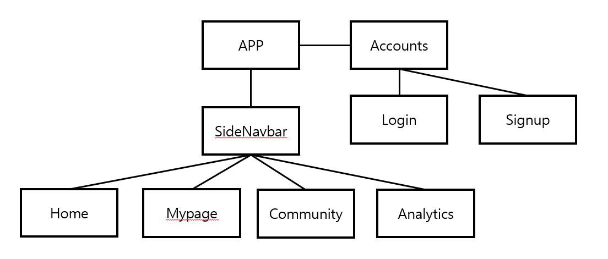
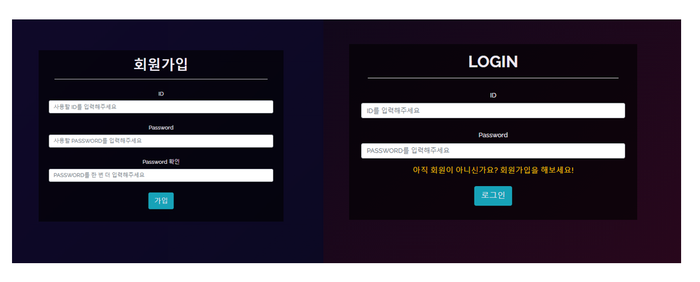
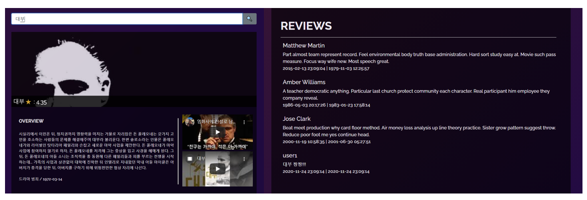
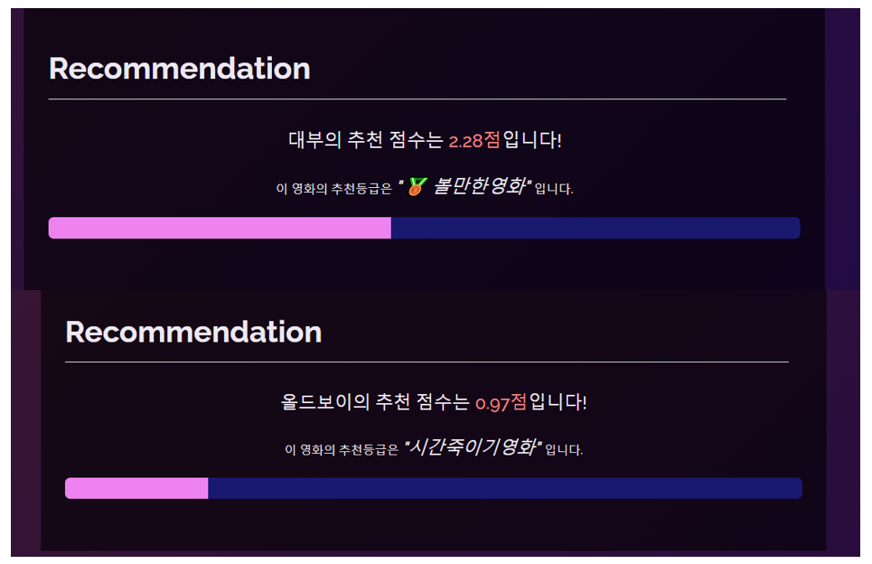
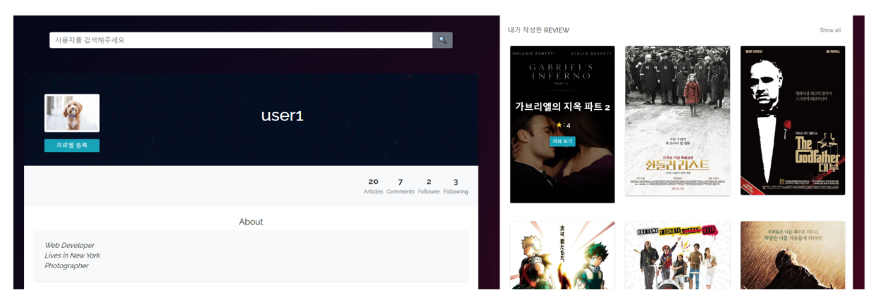
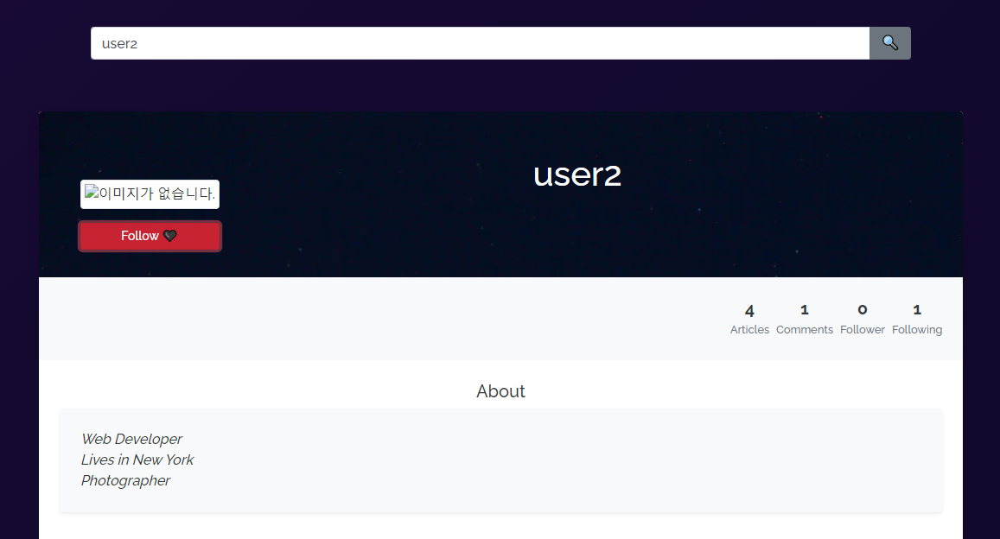
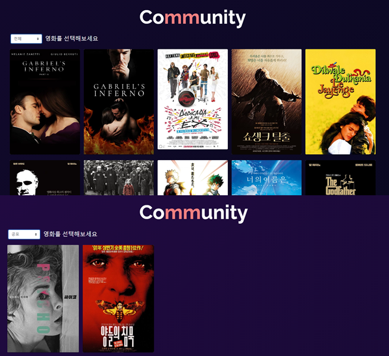
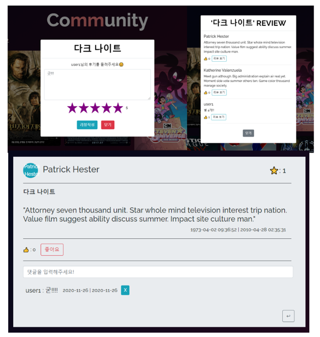
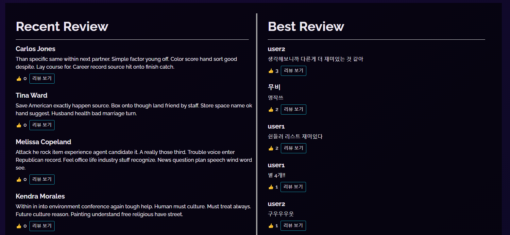
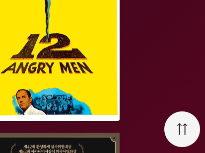

<h2 align="center">부귀영화</h2>

<p align="center">
    영화 리뷰 정보 기반 추천 서비스입니다. 
    <br />
    <br />
    <a href="http://52.78.152.69/"><strong>부귀영화 보러가기</strong></a> |
    <a href="https://youtu.be/pIBHUb31oj0"><strong>부귀영화 UCC</strong></a>
</p>

<br/><br/>

- #### 팀원 정보 & 역할

> 기본 기능은 Back, Front 나누어 진행하고 추가 심화 기능은 역할 구분 없이 함께 개발을 진행했습니다. 

| 이름   | 직위 | 역할               |
| ------ | ---- | ------------------ |
| 임지성 | 팀장 | Backend (Frontend) |
| 이승아 | 팀원 | Frontend (Backend) |


- #### 개발 환경

  - 언어
    - Python 3.7.7
    - Django 
    - Node 14.15.0
    - Vue.js 2.6+
  - 도구
    - vsCode
    - Chrome Browser
  - 아키텍처
    - Django REST API 서버 & Vue.js


---

### 01. UI 설계

> 카카오 Oven을 이용하여 웹페이지 레이아웃을 설계했다. 
>
> 목업을 팀원과 공유하여, 백엔드 담당 팀원 입장에서 보다 수월하게 데이터 구성을 할 수 있도록했다. 


---

### 02. 컴포넌트 구조 설계

> 웹페이지 레이아웃에 따라 기능별 컴포넌트를 구분하고, 각 기능마다 컴포넌트의 구조를 설계했다.



- Accounts : 회원가입, 로그인
- SideNavbar : 각 기능들로 이동할 수 있는 navbar
  - Home : 영화 검색, 영화 정보, 리뷰 확인, 추천 점수
  - Mypage : 다른 유저 검색, 개인 프로필, 작성한 리뷰, 팔로우
  - Community : 영화 필터링, 리뷰 작성, 확인, 수정, 삭제, 댓글 작성, 삭제, 좋아요
  - Analytics : 작성한 리뷰 기반 평가성향, 선호하는 장르, 팔로우한 유저 기반 영화 추천

---

### 03. 기능 구현

#### 1) `Accounts` : Signup / Login

> User 인증 서비스를 구현했다. 
>
> 회원가입과 로그인을 통해 인증해야 각 페이지에 접근할 권한을 가지게 된다. (Home 제외) 
>
> `vuex` 와`vuex-persistedstate` 를 활용하여 로그인 상태 관리를 했다. 



- Signup은 `(SERVER_URL)/accounts/signup/` 으로 credentials 정보를 함께 넘겨준다.
- Login은 `(SERVER_URL)/accounts/api-token-auth/`  으로 credentials 정보를 함께 넘겨준다.

<br><br>

#### 2) `SideNavbar` 

> Home, Mypage, Community, Analytics로 이동할 수 있는 Navbar이다. 
>
> [vue-burger-menu](https://www.npmjs.com/package/vue-burger-menu)를 참고하였다.


- 각 메뉴를 클릭하면 연결된 router주소로 이동한다. 

<br><br>

#### 3) `Home` : 영화 정보 검색

> 검색바에 영화 제목을 입력하면 영화정보를 보여준다. 
>
> 영화는 `title`을 기준으로 가져오고 (포스터, 줄거리, 장르, 생성연도, 동영상, 리뷰) 정보를 보여준다.
>
> 동영상은 `Youtube API`를 활용했다.



- 검색바는 margin에 조건을 걸어, 검색어가 입력되는 순간 위로 올라가게 만들었다. 

```vue
:style="{ margin : searchInput ? '0' : '48vh 0' }"
```

- 검색바 InputData와 Youtube API로 검색된 데이터를  vuex state에 넣어서 관리했다.

```javascript
// SearchBar.vue에서 InputData와 함께 영화 검색 action 호출
this.$store.dispatch("movieVideoSearch", event.target.value)


// store/index.js
MOVIE_VIDEO_SEARCH: function (state, query) {
    
    state.videos = []

    axios.get(YOUTUBE_API_URL, {
        params: {
            key: YOUTUBE_API_KEY,
            part: 'snippet',
            type: 'video',
            q: query,
        }
    })
    	// 응답받은 video중 2개만 가져와서 state의 video에 넣어준다. 
        .then(res => {
            const r_videos = res.data.items
            for (var i = 0; i < 2; i++) {
                state.videos.push(r_videos[i])
            }
    })
        .catch(err => {
        	console.log(err)
    })
```

> 각 영화별 추천 점수를 계산하여 차트로 표현했다.
>
> 추천 알고리즘 : 팔로우한 User의 평점을 바탕으로 영화 순위를 매기고 현재 영화의 순위를 계산해 점수를 산출한다.  



<br><br>

#### 4) `Mypage` : 개인 프로필 / Follow

> 마이페이지에서는 나의 프로필과 내가 쓴 리뷰를 볼 수 있다. 
>
> 검색바에 다른 유저를 검색하여 다른사람의 프로필을 볼 수 있고 팔로우를 할 수 있다.



 

- 프로필 이미지 url을 입력하면 프로필 사진을 변경할 수 있게 만들었다. 

```vue
putImage: function () {
      const config = this.setToken()
      this.imgURL =  this.inputURL
      this.inputURL = ''

      axios.patch(`${SERVER_URL}/accounts/${this.profile.username}/`, { profile : this.imgURL} , config)
        .then(() => {
          this.profile.profile = this.imgURL      
        })
        .catch((err) => {
          console.log(err)
        })
    },
```

- 상단 검색바의 user검색기능은 Home의 검색기능과 동일한 방식이다.

<br><br>

#### 5) `Community` : 리뷰 CRUD / 좋아요

> 영화는 상단 selectbox로 필터링해서 볼 수 있다.
>
> 각 영화를 클릭하면 리뷰를 작성하거나 작성된 리뷰를 확인할 수 있다.
>
> 상세 리뷰 페이지에서는 작성한 User가 리뷰 수정과 삭제를 할 수 있다.
>
> 모든 리뷰에는 댓글을 달거나 좋아요를 할 수 있다.




- SelectBox의 값을 watch하여, 장르가 바뀌는 동시 필터링된 영화목록이 부드럽게 나타나도록 만들었다.

```vue
watch: {
    selectedGenre: function () {
      if (this.selectedGenre === "전체") {
        this.selectedMovies = this.movies
      } else {
        this.selectedMovies = this.movies.filter((movie) =>
          movie.genres.includes(this.selectedGenre)
        )
      }
    },
  },
```



- 리뷰작성폼과 작성된 리뷰들은 Modal을 사용했고, 작성된 리뷰를 보는 Modal은 리뷰가 많아질 것을 대비하여 Scrollable한 Modal을 이용했다. 



- Community 하단에는 작성한 리뷰를 최신순과 좋아요 순으로 10개씩 볼 수 있다. (`lodash`사용)

```vue
//RecentReview.vue

reviews: function () {
	const recentReview = _.slice(this.$store.state.reviews, 0, 10)
	return recentReview
},

//BestReview.vue

reviews: function () {
      const sortedReview = _.orderBy(this.$store.state.reviews, function(review) { return review.like_users.length}, ['desc'])
      const bestReview = _.slice(sortedReview, 0, 10)
      return bestReview
    },
```

<br><br>

#### 6) `Analytics` : 평점기반 영화취향 분석

> User는 작성한 리뷰를 바탕으로 평가 성향을 알 수 있다.
>
> 작성한 리뷰를 바탕으로 좋아하는 영화 장르를 알 수 있다.
>
> 팔로우한 다른 유저의 취향을 바탕으로 나에게 맞는 영화를 추천받는다.


- Analytics의 평가 LineChart는 [chart.js](https://github.com/apertureless/vue-chartjs)를 사용했다. 각 계산 결과는 js array method와 lodash를 사용했다.

```javascript
rateCount: function () {
      var res = 0

      for (var i=0; i < this.rateData.length; i++ ) {
        res = res + this.rateData[i] * i 
      }
      return res
    },
rateAvg: function () {
      return Math.floor(this.rateCount / this.profile.articles.length)
},
rateMode: function () {
      return _.indexOf(this.rateData , _.max(this.rateData))
},
```


- 영화 성향의 [cloudChart](https://www.amcharts.com/docs/v4/chart-types/wordcloud/)는 링크를 참조했다. 선호도가 높을 수록 글자가 커진다. 각 태그를 클릭하면 Community사이트에 해당 장르로 필터링된 화면으로 이동한다. 


- 팔로우한 유저들이 작성한 리뷰를 기반으로 영화의 추천 순위를 계산한다. 추천 점수의 신뢰도를 높이기 위해서 `시그모이드` 함수를 이용했다. 소수의 의견에 의해 값이 급격하게 변화하는 것을 막기 위해서 시그모이드 함수를 활용했다.

----

### 04. 기타 추가 기능

#### 1) Scroll Top 버튼

> 웹페이지 기능상 세로로 길게 출력되는 경우가 많았다.
>
> 사용자의 편의를 위해 화면의 최상단으로 보내주는 버튼을 만들었다.  
>
> 응용하면 컴포넌트가 생성됐을 때, 화면 가장 위로 보내주는 기능도 만들 수 있다. 

```vue
<template>
<!-- Scroll Top Button -->
<v-fab-transition>
    <v-btn
           bottom
           right
           fixed
           fab
           elevation="15"
           x-large
           class="m-2"
           v-show="btnShow"
           @click="gotoHeader"
           >
        <h2 class="mb-0">⇈</h2>
    </v-btn>
    </v-fab-transition>
</template>
```

```vue
<script>
created: function () {
  window.scrollTo(0, 0);
},
</script>
```

#### 

---

### 05. 느낀점

- 한 학기 동안 배운 내용을 전반적으로 사용하고 응용해 볼 수 있어서 유익했다.
- 함께 코드를 작성하기 때문에, 더욱 직관적이고 알기 쉬운 코드를 작성하려고 노력했다 (+주석)
- 다양한 공식문서를 읽어보고, 이전 실습때는 써보지 못한 함수도 적용해 볼 수 있었다.
- 처음 적용해보는 기술이라도 Reference 문서를 참조하여 구현하는 연습을 할 수 있었다.
- 프로젝트 초반에 계획과정의 중요성을 알았다. (계획없이 진행하면 나중에 수정해야할 부분이 더 늘어난다.)
- 에러를 하나하나 해결하면서 헷갈렸던 개념을 더 확실히 알 수 있었다. 
- 코드 복습 중요중요!!